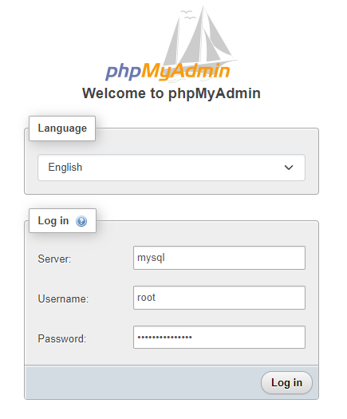

 # MySQL and phpMyAdmin by Docker Compose

## Requirements:
* docker >= 17.12.0+
* docker-compose

## Quick Start
* Clone or download this repository
* Go inside of directory,  `cd mysql-phpmyadmin-docker-compose`
* Run this command `docker-compose up -d`

## Environments
This Compose file contains the following environment variables:

* `MYSQL_DATABASE` the default value is **yourdatabase**
* `MYSQL_ROOT_PASSWORD` the default value is **setrootpassword**
* `MYSQL_USER` the default value is **dbuser**
* `MYSQL_PASSWORD` the default value is **dbpassword**
* `PHPMYADMIN_PORT` the default value is **6060**

## Access to MySQL: 
* `localhost:3306`
* **Username:** dbuser 
* **Password:** dbpassword 

## Access to phpMyAdmin: 
* **URL:** [http://localhost:6060](http://localhost:6060)
* **Server:** mysql 
* **Username:** root _or_ dbuser
* **Password:** setrootpassword _or_ dbpassword

## Are you new to MySQL?

[MySQL Database - Full Course](https://www.youtube.com/watch?v=ER8oKX5myE0)